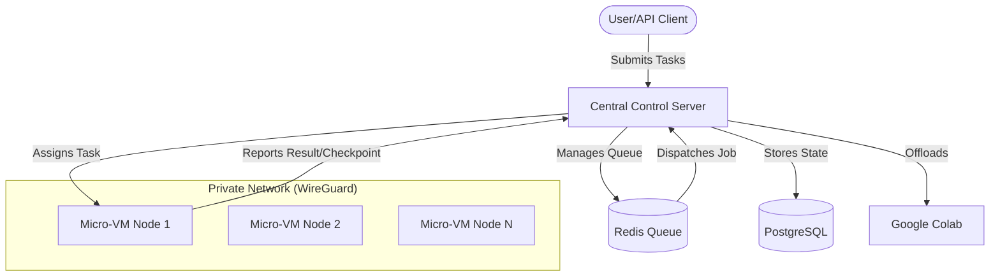

# Distributed Infrastructure with Micro-VMs and Central Orchestration

## Overview

The **Distributed Infrastructure with Micro-VMs and Central Orchestration** project is a high-density, scalable computing platform designed to coordinate thousands of minimalist micro-virtual machines (Micro-VMs) from a central control server. Utilizing **Firecracker** for high-performance virtualization and **WireGuard** for secure, private networking, the system enables rapid deployment and efficient execution of distributed tasks.

## Key Features

- **High-Density Virtualization**: Leverages Firecracker to run micro-VMs with a memory footprint as low as 10 MB, allowing thousands of nodes on a single host.
- **Centralized Orchestration**: A Python-based FastAPI server manages node registration, task queuing, and lifecycle monitoring.
- **Go-Based Worker Agent**: A lightweight agent inside each VM handles secure communication, task execution, and real-time checkpointing.
- **Secure Mesh Networking**: Integrated WireGuard tunneling ensures all execution nodes communicate over a private, encrypted network.
- **External Resource Integration**: Capability to offload tasks to external computing resources like Google Colab.
- **Automatic Failure Recovery**: Task-level checkpointing allows for seamless resumption of work if a node fails.

## Project Structure

- `agent/`: Go-based agent software for execution nodes.
- `server/`: Central orchestration server (FastAPI, Redis, PostgreSQL).
- `vm-builder/`: Tools and scripts for building minimalist Linux kernel and rootfs images.
- `firecracker/`: Firecracker micro-VM monitor and configuration utilities.
- `wireguard/`: VPN configuration and peer management scripts.
- `monitoring/`: Infrastructure for real-time performance and error tracking.
- `docs-milestones/`: Detailed project documentation and milestone tracking.

## Tech Stack

### Central Control Server
- **Framework**: FastAPI (Python 3.10+)
- **Task Queue**: Redis with RQ (Redis Queue)
- **Database**: PostgreSQL (SQLAlchemy ORM)
- **Deployment**: Docker & Docker Compose

### Execution Node (Agent)
- **Language**: Go (v1.20+)
- **Networking**: WireGuard (Userspace/Kernel)
- **Virtualization**: Firecracker Micro-VM Engine

## Architecture



## Getting Started

### Prerequisites
- Docker & Docker Compose
- Go (for agent development)
- Python 3.10+ (for server development)
- WireGuard installed on host (for networking)

### Quick Start (Server)
1. Navigate to the root directory.
2. Start the essential services:
   ```bash
   docker-compose up -d
   ```
3. Initialize the database:
   ```bash
   cd server
   python init_db.py
   ```
4. Start the orchestration server:
   ```bash
   uvicorn main:app --reload
   ```

### Quick Start (Node)
1. Build the agent:
   ```bash
   cd agent
   go build -o agent
   ```
2. Configure WireGuard (see `wireguard/` for scripts).
3. Run the agent (requires `SERVER_URL` environment variable):
   ```bash
   export SERVER_URL=http://<server-wireguard-ip>:8000
   ./agent
   ```

## Development Status

This project is currently in the **MVP/Phase 1** stage. Key missing features being worked on include massive scaling optimizations, advanced resource-based scheduling, and full visual control panel integration.

---
*For more details, see the documentation in `docs-milestones/`.*
